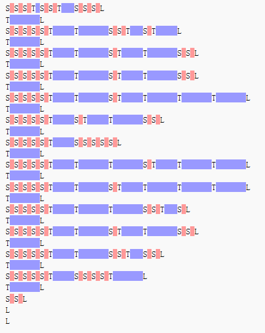

# Whitespace 语言的解释器 #

最近似乎很热衷于写各种语法解析的程序，这回想起了一个很有趣的语言—— Whitespace ，于是使用 Java 写了一个 Whitespace 的解释器。

简单的介绍一下 Whitespace。  
Whitespace 是一种简单的编程语言，它的源代码里的有效字符只有空格[Space]、制表符[Tab]和换行符[LF]。这些空白字符在很多编程语言里都会被忽略，而 Whitespace 语言正好相反，这三个字符以外的字符都会被忽略，所以你可以在任何地方写注释。  
然而， Whitespace 又是一种深奥的编程语言，最初它只是为了娱乐而被开发出来，但它的语言与虚拟机模型是具有图灵完备性的，也就是说，任何 C++ , Java 能够实现的程序， Whitespace 也能够实现。

以下是来自中文维基的带语法高亮和注释的 hello world 程序  
  
此程序运行的结果即是打印出"Hello, world!"

关于 Whitespace 的更详细的资料可以参考[中文维基](http://zh.wikipedia.org/wiki/Whitespace)与其[官方主页](http://compsoc.dur.ac.uk/whitespace/)。

建立 Whitespace 的[虚拟机模型](https://github.com/azige/whitespace-interpreter/blob/master/src/main/java/io/github/azige/whitespace/vm/WhitespaceVM.java)并不困难，因为其结构还是相当简单的，对于指令的实现也同样很简单，但是，让本人困扰的是指令序列，也就是程序。 Whitespace 中存在标签以及"goto"指令，如果只是单纯的一条一条指令的执行，碰到向后的"goto"指令的时候就会很麻烦。于是本人将执行方式设计为将完整的指令序列全部读取并解析后，添加到一个[指令序列执行器](https://github.com/azige/whitespace-interpreter/blob/master/src/main/java/io/github/azige/whitespace/command/CommandListExecutor.java)对象中，再逐条执行，这样这个对象能够了解整个指令序列的上下文，并且能够很好的进行流程控制的工作。

为了建立这样一个指令序列执行器，不得不把指令也抽象成对象。幸好 Whitespace 的指令只有至多一个参数，因此指令对象也不需要设计得很复杂。但是如何把指令对象与指令的调用联系起来呢？对指令的类型使用 switch-case 肯定不合适，那么只能使用抽象方法来将指令的调用进行动态绑定了。最后为了避免类的数量过于膨胀，使用了[工厂模式与内部类](https://github.com/azige/whitespace-interpreter/blob/master/src/main/java/io/github/azige/whitespace/command/DefaultCommandFactory.java)的方式来组织这一堆的指令类。

[语法解析器](https://github.com/azige/whitespace-interpreter/blob/master/src/main/java/io/github/azige/whitespace/WhitespaceParser.java)沿用了之前的 JSON 处理库中的语法解析器的风格，不过这究竟是不是一个好的风格可能还得再实践几次并继续改进。

完整的代码以及发行包可以从仓库获得  
[https://github.com/azige/whitespace-interpreter](https://github.com/azige/whitespace-interpreter)